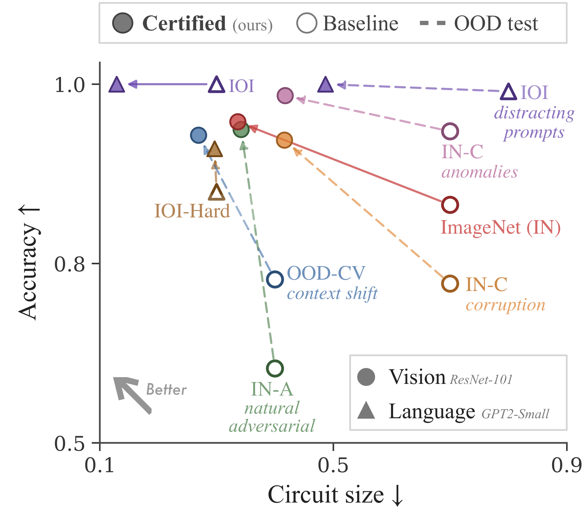

### [ICML'26] Certified Circuits: Stability Guarantees for Mechanistic Circuits

<p align="center">
<a href="https://alaaanani.github.io/"><strong>Alaa Anani</strong></a><sup>1,2</sup>,
<a href="https://www.t-lorenz.com/">Tobias Lorenz</a><sup>2</sup>,
<a href="https://www.mpi-inf.mpg.de/departments/computer-vision-and-machine-learning/people/bernt-schiele">Bernt Schiele</a><sup>1</sup>,
<a href="https://cispa.de/en/people/mario.fritz">Mario Fritz</a><sup>2,*</sup>,
<a href="https://www.mpi-inf.mpg.de/departments/computer-vision-and-machine-learning/people/jonas-fischer">Jonas Fischer</a><sup>1,*</sup>
</p>

<p align="center">
<sup>1</sup> Max Planck Institute for Informatics,
<sup>2</sup> CISPA Helmholtz Center for Information Security<br>
<sup>*</sup> Equal advising
</p>

[](https://alaaanani.github.io/#/project/certified-circuits) [](https://arxiv.org/abs/2602.22968)

<table>
  <tr>
    <td></td>
    <td></td>
  </tr>
</table>

**Abstract:**
Understanding how neural networks arrive at their predictions is essential for debugging, auditing, and deployment. Mechanistic interpretability pursues this goal by identifying circuits - minimal subnetworks responsible for specific behaviors. However, existing circuit discovery methods are brittle: circuits depend strongly on the chosen concept dataset and often fail to transfer out-of-distribution, raising doubts whether they capture concept or dataset-specific artifacts. We introduce Certified Circuits, which provide provable stability guarantees for circuit discovery. Our framework wraps any black-box discovery algorithm with randomized data subsampling to certify that circuit component inclusion decisions are invariant to bounded edit-distance perturbations of the concept dataset. Unstable neurons are abstained from, yielding circuits that are more compact and more accurate. On ImageNet and OOD datasets, certified circuits achieve up to 91% higher accuracy while using 45% fewer neurons, and remain reliable where baselines degrade. Certified Circuits puts circuit discovery on formal ground by producing mechanistic explanations that are provably stable and better aligned with the target concept. Code will be released soon!

---

### Citation

If you find our work useful in your research, please cite it as:

```bibtex
@inproceedings{anani2026certified,
    title={Certified Circuits: Stability Guarantees for Mechanistic Circuits},
    author={Anani, Alaa and Lorenz, Tobias and Schiele, Bernt and Fritz, Mario and Fischer, Jonas},
    booktitle={Proceedings of the International Conference on Machine Learning (ICML)},
    year={2026}
}
```
